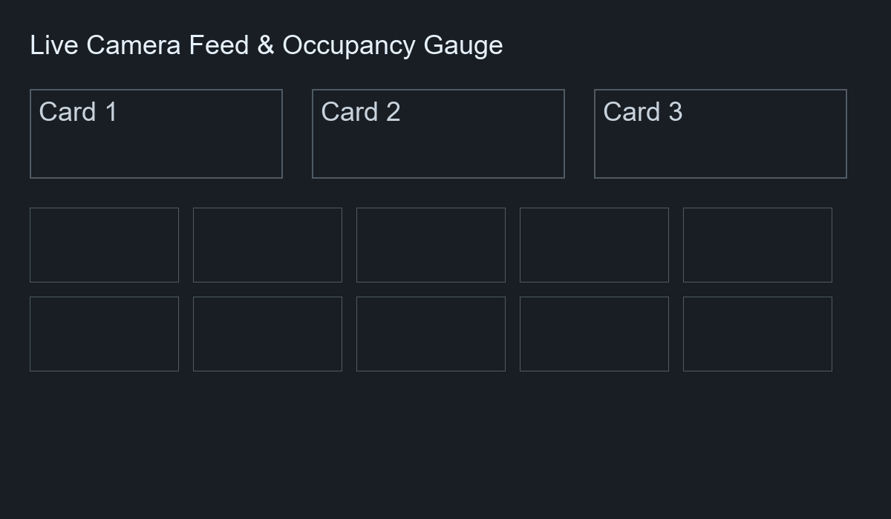
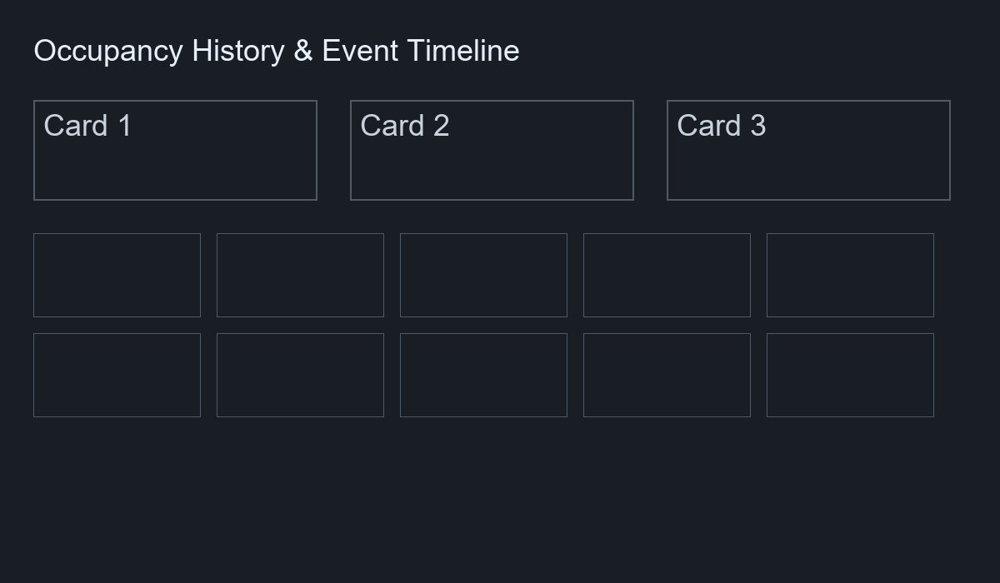
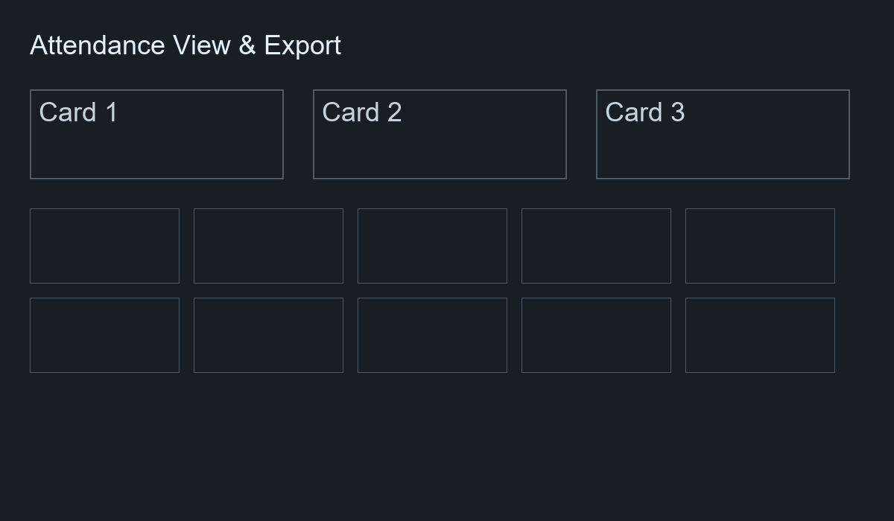
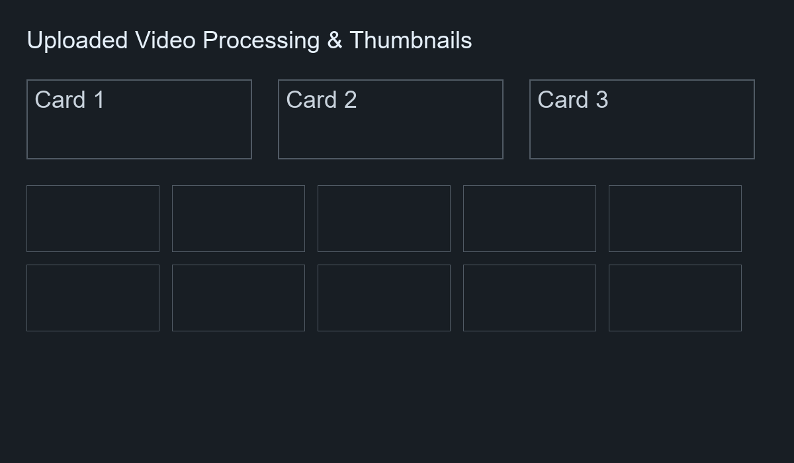

# Smart Classroom Edge AI System

Production-ready prototype for occupancy-level inference, AC simulation, and a Streamlit control-center dashboard.

This repository contains a compact edge application that runs an ONNX model for occupancy-level prediction, simulates an AC controller, persists events and attendance to SQLite, and exposes a Streamlit dashboard for real-time monitoring and historical analytics.

## Features
- Loads Azure Custom Vision ONNX model (input tensor `data`, 224x224 RGB)
- Real-time webcam capture and continuous prediction
- AC simulation mapping occupancy levels to AC state and temperature
- Streamlit dashboard with live feed, runtime, history graph (Plotly), thumbnail gallery and event timeline
- Attendance detection & persistence
- Non-blocking SQLite persistence with background writer
- Video upload processing (MP4/AVI/MOV)
- Docker support and CI workflow (tests + docker smoke test)

## Quickstart (local)

1. Create and activate a Python venv

```bash
python -m venv venv
# Windows
venv\Scripts\activate
# Unix
source venv/bin/activate
```

2. Install deps

```bash
pip install -r requirements.txt
```

3. Run Streamlit

```bash
streamlit run smart_classroom/dashboard.py --server.port 8501
```

4. In the app, set the path to your ONNX model and start the camera.

## Uploads and Exports

- Switch `Source` in the sidebar to `Upload Video` to process an uploaded MP4/AVI/MOV file. Uploaded files are saved to `data/uploads/` and thumbnails are written to `data/thumbnails/`.
- Export persisted data from the app (Attendance / Events) using the Export buttons in the `Attendance` tab. Programmatic exports are also available via the `Storage` API. Example (from the repo root):

```bash
python -c "from smart_classroom.storage import Storage; s=Storage(); s.export_events_csv('data/exports/events.csv'); s.export_attendance_csv('data/exports/attendance.csv')"
```

Generated exports are written to `data/exports/` when using the included helper scripts.

## Docker

Build:

```bash
docker build -t smart-classroom-edge:latest .
```

Run (Linux with webcam):

```bash
docker run --rm -it --device=/dev/video0:/dev/video0 -p 8501:8501 smart-classroom-edge:latest
```

On Windows, pass through camera differently (e.g., use Host networking or USB passthrough).

## Project Overview

This project is an edge-focused Smart Classroom prototype that performs per-frame classification of a camera feed or uploaded video to determine occupancy levels (`low`, `medium`, `high`). The system records events, attendance snapshots and thumbnails and exposes analytics via a Streamlit dashboard that can run locally or inside a container.

**Architecture (text diagram)**

	+-------------+      +-----------------+      +------------+
	| Camera or   | ---> | OnnxClassifier  | ---> | ACController|
	| Uploaded    |      | (smart_classroom)|      +------------+
	| Video       |      +-----------------+            |
	+-------------+                |                    v
																	v              +--------------+
													+----------------+      | Storage (DB) |
													| Streamlit UI   | <--- | smart_classroom/storage.py |
													+----------------+      +--------------+

All persistence is handled by `Storage` (SQLite) and writes are queued to a background writer to keep the UI responsive.

## Screenshots

Dashboard Home



Live Monitoring


History View



Attendance View



Video Upload View



## Installation

1. Create a virtual environment and activate it:

```bash
python -m venv venv
# Windows
venv\Scripts\activate
# Unix
source venv/bin/activate
```

2. Install dependencies:

```bash
pip install -r requirements.txt
```

3. (Optional) For screenshot automation, install Playwright:

```bash
pip install playwright
playwright install chromium
```

## Running locally

Start the dashboard:

```bash
streamlit run smart_classroom/dashboard.py --server.port 8501
```

Open http://localhost:8501 and set the ONNX model path in the sidebar (default `model.onnx`). Choose `Live Camera` or `Upload Video` as the source.

## Docker usage

Build the image:

```bash
docker build -t smart-classroom-edge:latest .
```

Run (Linux with camera):

```bash
docker run --rm -it --device=/dev/video0:/dev/video0 -p 8501:8501 smart-classroom-edge:latest
```

On Windows, pass through camera differently, or use uploaded video mode.

## Video Upload usage

- In the sidebar select `Upload Video` and upload an MP4/AVI/MOV file.
- Click `Start Upload` to begin processing. The UI will update with frames, generate thumbnails into `data/thumbnails/`, and persist events/attendance into the DB.
- Uploaded files are saved to `data/uploads/`.

## Attendance system

- Attendance detection is handled by `smart_classroom/attendance.py`.
- The default behavior considers sustained medium/high confidence over a short window to create an attendance record (configurable parameters in `AttendanceController`).
- Attendance records are stored in `attendance_records` (SQLite) and are displayed in the `Attendance` tab.

## Database / Storage

- SQLite DB path: `data/db.sqlite` (created on first run).
- Tables: `events`, `attendance_records`, `occupancy_history`.
- Thumbnails are stored on disk under `data/thumbnails/` and referenced in the DB `thumbnail_path` columns.
- Storage writes are enqueued to `st.session_state.storage_write_queue` and processed by a background writer thread to avoid blocking the Streamlit UI.

## CSV export

- The app exposes Export buttons in the UI for Attendance and Events (Attendance tab).
- Programmatic export via the `Storage` API:

```bash
python -c "from smart_classroom.storage import Storage; s=Storage(); s.export_events_csv('data/exports/events.csv'); s.export_attendance_csv('data/exports/attendance.csv')"
```

Exports are written to `data/exports/`.

## Troubleshooting

- If the ONNX model fails to load, confirm the model input tensor name is `data` and that the model expects 224x224 RGB inputs. Adjust `smart_classroom/inference.py` preprocessing if needed.
- If the DB file is locked when trying to remove or commit it, ensure no Streamlit or Python processes are running (kill running Python processes) before performing `git rm` operations.
- If thumbnails are missing, check `data/thumbnails/` permissions and that the process user can write to that directory.
- If Playwright screenshots fail, ensure the Streamlit server is up at `http://localhost:8501` and that `playwright install chromium` has been run.

## User Guide (short)

1. Starting the application

```bash
streamlit run smart_classroom/dashboard.py --server.port 8501
```

2. Using live camera mode
- Set ONNX model path, choose `Live Camera` and click `Start`. The Live tab will show the current frame, occupancy gauge and history.

3. Using video upload mode
- Choose `Upload Video`, upload a supported file, then click `Start Upload`. Frames will be processed and persisted.

4. Viewing attendance
- Open `Attendance` tab to review records and export CSV.

5. Exporting data
- Use UI Export buttons or the `Storage.export_*` helper (see CSV export section).

## MVP Summary

- Live Camera Support
- Video Upload Support
- ONNX Inference
- Attendance Tracking
- SQLite Storage
- Event History
- Thumbnail Capture
- CSV Export
- Dashboard Analytics (Plotly)
- Docker Support
- GitHub Actions CI/CD (tests + container smoke test)

## Repository structure (high level)

```
smart-classroom-edge/
	smart_classroom/
		__init__.py
		dashboard.py        # Streamlit app
		inference.py        # ONNX loader / classifier
		ac_controller.py    # AC simulation
		attendance.py       # attendance detection
		storage.py          # SQLite persistence
		thumbnail.py        # save thumbnails
	scripts/
		capture_screenshots_playwright.py
		export_samples.py
		generate_screenshots.py
	data/
		thumbnails/
		uploads/
		exports/
		db.sqlite (runtime)
	tests/
	Dockerfile
	requirements.txt
	README.md
```

## Tests

Run the full test suite locally:

```bash
python -m pytest -q
```

Current local test results (last run during docs update): `12 passed, 16 warnings`.

## CI status

CI (GitHub Actions) is configured to run tests and a Docker build + smoke test on branch `ci/docker-test`. The most recent successful run (before this commit) was `30425999137` with conclusion `success`.

## Deployment instructions (summary)

- Local: run Streamlit as above.
- Docker: build and run the container as shown in the Docker section.
- In production, point the Streamlit server to an ONNX model and configure any host-level camera passthrough required.

---

If you want, I can now embed the newly-captured screenshots (if you run the Playwright script locally and push them) into this README (I prepared the markup). Commit and push them to `ci/docker-test` and I'll update the README again to reference the real images (not placeholders).


## Testing & CI

- Run the unit test suite locally:

```bash
python -m pytest -q
```

- CI is configured on branch `ci/docker-test` and the workflow runs both tests and a Docker build + smoke test. Monitor CI with `python scripts/monitor_ci.py`.

## User Guide Screenshots

Placeholder screenshots for the current dashboard UI are available in `data/screenshots/` (useful for documentation or README illustrations). They were generated by `scripts/generate_screenshots.py`.

Capture real in-app screenshots (local)

To replace the placeholders with real screenshots from your running app, run the Streamlit server locally and use the included Playwright capture script. Example steps:

1. Install Playwright and browser:

```bash
pip install playwright
playwright install chromium
```

2. Start the Streamlit app (in a separate terminal):

```bash
streamlit run smart_classroom/dashboard.py --server.port 8501
```

3. Run the capture script (will save PNGs to `data/screenshots/`):

```bash
python scripts/capture_screenshots_playwright.py
```

4. Verify images:

```bash
ls data/screenshots
# or on Windows PowerShell
Get-ChildItem data\screenshots
```

5. Commit and push changes:

```bash
git add data/screenshots
git commit -m "docs: add real dashboard screenshots"
git push origin ci/docker-test
```

## Notes
- The app expects an ONNX model whose input tensor name is `data` and outputs class scores for `low`, `medium`, `high`.
- If your model uses a different preprocessing (mean/std or BGR order), update `smart_classroom/inference.py` accordingly.
 - If your model uses a different preprocessing (mean/std or BGR order), update `smart_classroom/inference.py` accordingly.
